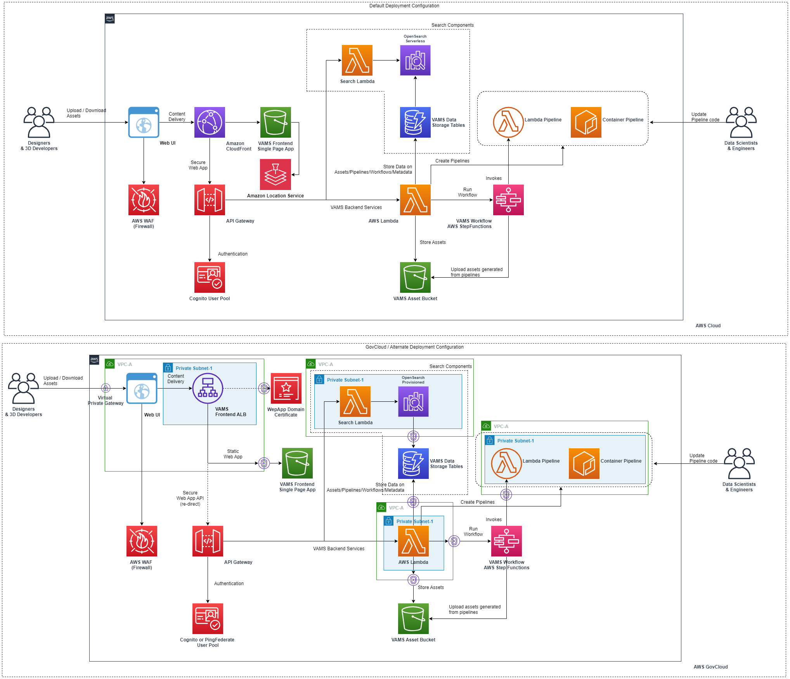
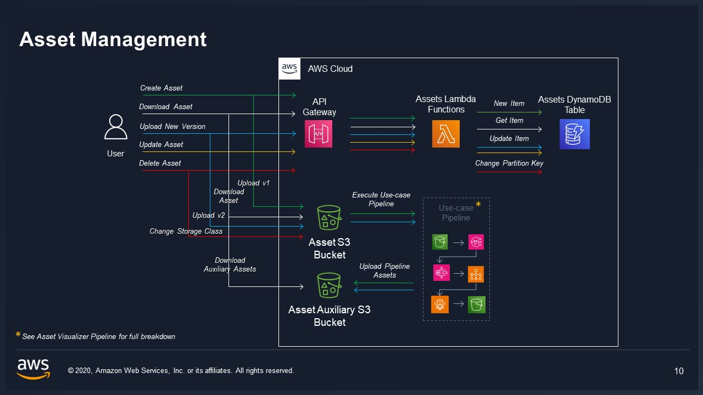
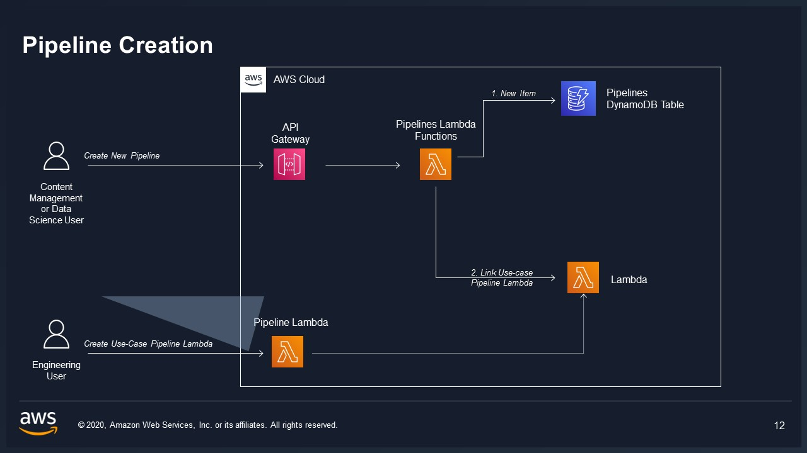
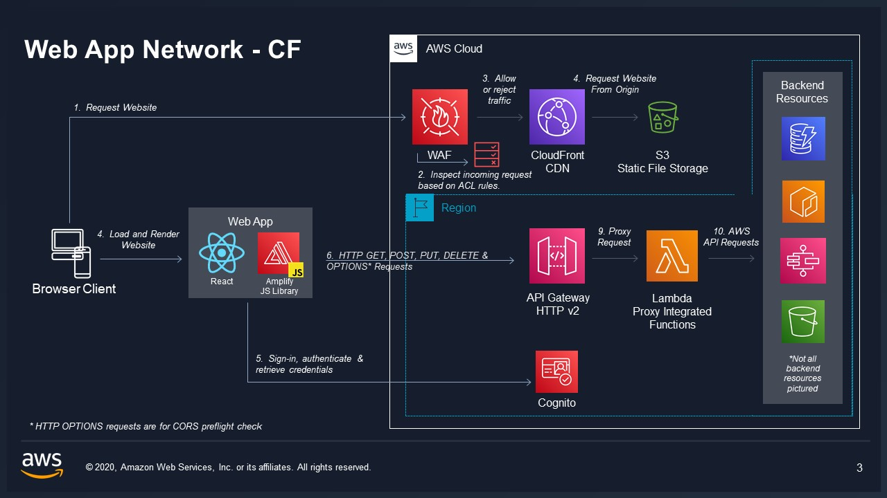
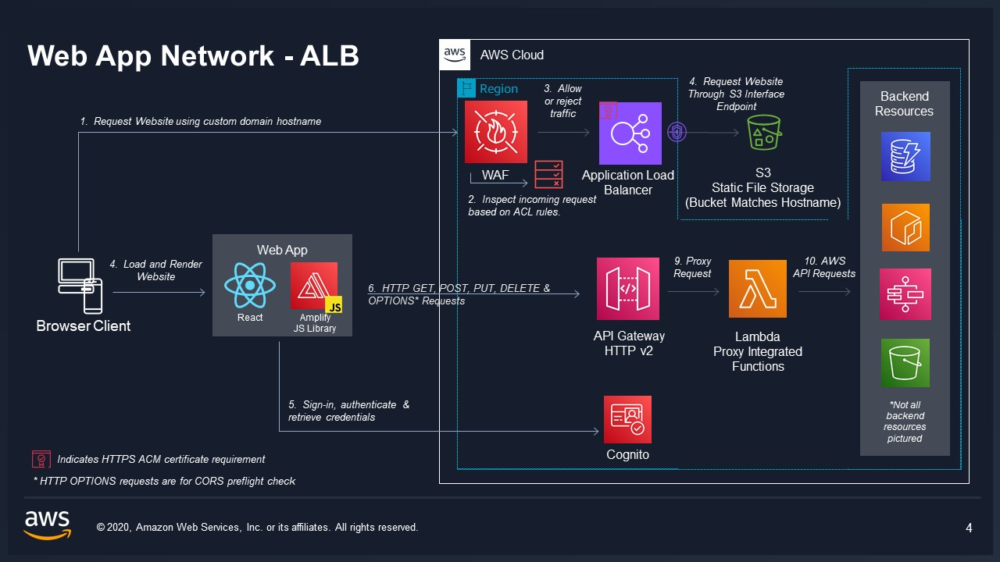
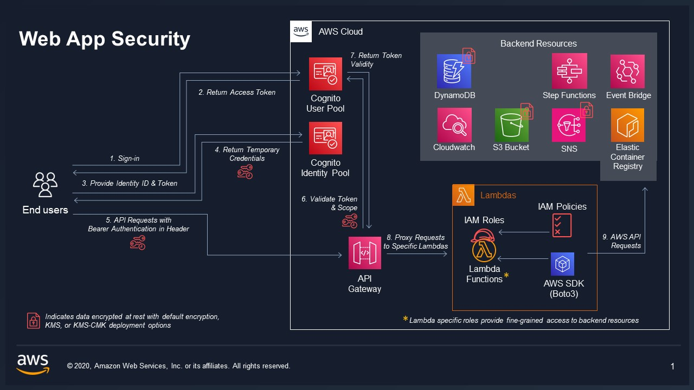

# Visual Asset Management System(VAMS)

## _Notice_

_Visual Asset Management System (VAMS) version 2.X+ is the official recognized and approved version series._

_All previous 1.X versions of VAMS, although still available, will no longer be supported or recommended for use._

## Introduction

_Visual Asset Management System (VAMS)_ is a purpose-built, AWS native solution for the management and distribution of specialized visual assets used in spatial computing. VAMS offers a simplified solution for organizations to ingest, store, and manage visual assets in the cloud, which empowers any user with a web browser to upload, manage, visualize, transform, and retrieve visual assets. Existing workflows that leverage both custom code and pre-built or third-party applications can also be migrated to VAMS and ran in the AWS cloud, as opposed to being limited by the on-premise capacity available. VAMS is customizable and expandable with option of being further tailored to specific use-cases by development teams.

_Customer Value:_ VAMS addresses challenges faced by customers embarking on Spatial Computing initiatives, such as Augmented and Virtual Reality (AR/VR). Organizations that previously had to manage these assets on local systems can now do so from a web-based application.

Leveraging Amazon Simple Storage Service (Amazon S3) as a low-cost, high availability storage layer, VAMS provides a purpose-built API for 3D asset management. This API provides a layer of abstraction, allowing custom integrations to be built. Custom integrations allow workloads and applications to be moved to the cloud, unlocking access to the entire breadth and depth of the AWS ecosystem.

Overall, VAMS super power comes from its use of common AWS services, open source logic, and extensibility to add to or combine with other architectures, solutions, and strategies.

_Use Cases:_
Sample use cases that have leveraged early iterations of VAMS include:

-   Distribution and management of 3D Assets using highly available S3 storage
-   Modifications of 3D assets using VAMS Pipelines
-   Creating workflows for 3D asset modification using VAMS Workflows

## Screenshots

## Architecture Overview

## 3D Asset Types Supported for In-Browser Viewing

VAMS currently integrates with several different asset viewers and supports the following formats for viewing 3D assets interactively.

| Name                              | Extension | Type   | Viewer             | Excluded Library | Notes                                                                                        |
| :-------------------------------- | :-------- | :----- | :----------------- | :--------------- | -------------------------------------------------------------------------------------------- |
| Wavefront                         | obj       | text   | Online 3D Viewer   |                  |                                                                                              |
| 3D Studio                         | 3ds       | binary | Online 3D Viewer   |                  |                                                                                              |
| Stereolithography                 | stl       | text   | Online 3D Viewer   |                  |                                                                                              |
| Stereolithography                 | stl       | binary | Online 3D Viewer   |                  |                                                                                              |
| glTF                              | gltf      | text   | Online 3D Viewer   |                  |                                                                                              |
| glTF                              | glb       | binary | Online 3D Viewer   |                  |                                                                                              |
| Object File Format                | off       | text   | Online 3D Viewer   |                  |                                                                                              |
| Object File Format                | off       | binary | Online 3D Viewer   |                  |                                                                                              |
| Dotbim                            | bim       | text   | Online 3D Viewer   |                  |                                                                                              |
| Rhinoceros 3D                     | 3dm       | binary | Online 3D Viewer   |                  |                                                                                              |
| Filmbox                           | fbx       | text   | Online 3D Viewer   |                  |                                                                                              |
| Filmbox                           | fbx       | binary | Online 3D Viewer   |                  |                                                                                              |
| Collada                           | dae       | text   | Online 3D Viewer   |                  |                                                                                              |
| Virtual Reality Modeling Language | wrl       | text   | Online 3D Viewer   |                  |                                                                                              |
| 3D Manufacturing Format           | 3mf       | text   | Online 3D Viewer   |                  |                                                                                              |
| Additive Manufacturing            | amf       | text   | Online 3D Viewer   |                  |                                                                                              |
| (Excluded\*) Dotbim               | ifc       | text   | Online 3D Viewer\* | web-ifc          |                                                                                              |
| (Excluded\*) FreeCad              | fcstd     | text   | Online 3D Viewer\* | occt-import-js   |                                                                                              |
| (Excluded\*) Boundary Rep         | brep      | text   | Online 3D Viewer\* | occt-import-js   |                                                                                              |
| (Excluded\*) ISO 10303 CAD        | step      | text   | Online 3D Viewer\* | occt-import-js   |                                                                                              |
| (Excluded\*) Graphics Exchange    | iges      | text   | Online 3D Viewer\* | occt-import-js   |                                                                                              |
| Point Cloud - LiDAR Data Exchange | laz       | binary | Potree Viewer      |                  |                                                                                              |
| Point Cloud - LiDAR Data Exchange | las       | binary | Potree Viewer      |                  |                                                                                              |
| Point Cloud - LiDAR Data Exchange | e57       | binary | Potree Viewer      |                  |                                                                                              |
| Polygon File Format               | ply       | binary | Potree Viewer      |                  | Type stores meshes and point clouds - VAMS currently showing only point cloud viewer for PLY |
| Polygon File Format               | ply       | text   | Potree Viewer      |                  |                                                                                              |

Viewers available include:

-   [Online 3D Viewer](https://github.com/kovacsv/Online3DViewer)
-   [Potree Viewer](https://github.com/potree/potree)

Please take note:

-   While we are limited to these formats to view assets, any file format may be uploaded to VAMS.
-   There are some limitations with formats that leverage multiple files such as glTF that uses json with references to other files.
-   Some viewers like Potree Viewer requires additional pipelines to be deployed to fully generate and view point cloud files.

Exclusion\* notes:

-   Online 3D Viewer requires the more restrivi licensed opencascade sub-library to view these file types. They are excluded due to VAMS license restrictions on carrying LGPL libraries.
-   -   If an organizations wishes to implement this sub-library and view these excluded file types with Online 3D viewer, add the excluded file types to the `onlineViewer3DFileFormats` constants array in `./web/src/common/constants/fileFormats.js`. Then add the listed excluded npm library in the web folder through `yarn add`.

## Install

> **Warning**
> This solution allows you to interact with third-party software libraries and generative AI (GAI) models from third party providers. Your use of the software libraries and third-party GAI models is governed by the terms provided to you by the third-party software library and GAI model providers when you acquired your license to use them (for example, their terms of service, license agreement, acceptable use policy, and privacy policy).

> You are responsible for ensuring that your use of the third-party software libraries and GAI models comply with the terms governing them, and any laws, rules, regulations, policies, or standards that apply to you.

> You are also responsible for making your own independent assessment of the third-party software libraries and GAI models that you use, including their outputs and how third-party software libraries GAI model providers use any data that might be transmitted to them based on your deployment configuration. AWS does not make any representations, warranties, or guarantees regarding the third-party software libraries and GAI models, which are “Third-Party Content” under your agreement with AWS. This solution is offered to you as “AWS Content” under your agreement with AWS.

### Requirements

-   Python 3.12
-   Poetry (for managing python dependencies in the VAMS backend)
-   Docker
-   Node >=18.7
-   Yarn >=1.22.19
-   Node Version Manager (nvm)
-   Conda-forge [only for optional local development]
-   AWS cli
-   AWS CDK cli
-   Programatic access to AWS account at minimum access levels outlined above.

### Deploy VAMS for the First Time

#### Build & Deploy Steps (Windows/Linux/Mac)

VAMS Codebase is changing frequently and we recommend you checkout the stable released version from github.

For windows direct deployments, some changes may be needed to the below instructions in how to specify environment variables at the command line.

You can identify stable releases by their tag. Fetch the tags `git fetch --all --tags` and then `git checkout tags/TAG` or `git checkout -b TAG tags/TAG` where TAG is the actual desired tag. A list of tags is found by running `git tag --list` or on the [releases page](https://github.com/awslabs/visual-asset-management-system/releases).

Note: If you are running behind a HTTPS SSL proxy that requires network nodes to have a custom SSL certificate, head to the [CDK SSL Deploy in the developer guide](./DeveloperGuide.md#CDK-Deploy-with-Custom-SSL-Cert-Proxy) to learn more.

1. `cd ./web && nvm use` - make sure you're node version matches the project. Make sure Docker daemon is running.

2. `yarn install` - make sure you install the packages required by the web app (Take note, `npm install` does not result in a working build of the application - please use yarn).

3. `npm run build` - build the web app.

4. `cd ../infra && npm install` - installs dependencies defined in package.json.

5. If you haven't already bootstrapped your aws account with CDK. `cdk bootstrap aws://101010101010/us-east-1` - replace with your account and region. If you are boostrapping a GovCloud account, run `export AWS_REGION=[gov-cloud-region]` as the AWS SDK needs to be informed to use GovCloud endpoints. Note: Use the least-permissive AWS IAM role for boostrapping that can still generate the needed AWS components from CloudFormation for VAMS.

6. Modify the `config.json` in `/infra/config` to set the VAMS deployment parameters and features you would like to deploy. Recommended minimum fields to update are `region`, `adminEmailAddress`, and `baseStackName` when using the default provided template. More information about the configuration options can be found in the [Configuration Guide](./ConfigurationGuide.md).

7. (Optional) Override the the CDK stack name and region for deployment with environment variables `export AWS_REGION=us-east-1 && export STACK_NAME=dev` - replace with the region you would like to deploy to and the name you want to associate with the cloudformation stack that the CDK will deploy.

8. (FIPS Use Only) If deploying with FIPS, enable FIPS environment variables for AWS CLI `export AWS_USE_FIPS_ENDPOINT=true` and enable `app.useFips` in the `config.json` configuration file in `/infra/config`

9. (External VPC Import Only) If importing an external VPC with subnets in the `config.json` configuration, run `cdk deploy --all --require-approval never --context loadContextIgnoreVPCStacks=true` to import the VPC ID/Subnets context and deploy all non-VPC dependant stacks first. Failing to run this with the context setting or configuration setting of `loadContextIgnoreVPCStacks` will cause the final deployment of all stacks steps to fail. See configuration guide for VPC import on additional troubleshooting. Note: Review the Configuration Guide's Additional Notes section for # of IPs needed per subnet.

10. `cdk deploy --all --require-approval never` - An account is created in an AWS Cognito User Pool using the email address specified in the infrastructure config file. Expect an email from <no-reply@verificationemail.com> with a temporary password.

    10a. Ensure that docker is running before deploying as a container will need to be built

#### Deployment Success

1.a (Default)(Cloudfront Deployment) Navigate to URL provided in `{stackName].WebAppCloudFrontDistributionDomainName{uuid}` from `cdk deploy` output.

1.b (ALB Deployment Feature) Navigate to URL provided in `webDistributionUrl` from `cdk deploy` output.

2. Check email for temporary account password to log in with the email address you provided.

3. (Optional) Follow [Create New VAMS User in permission guide](./PermissionsGuide.md#create-new-vams-user) to add additional users

### Multiple Deployments With Different or Same Region in Single Account

You can change the region and deploy a new instance of VAMS by changing the `./infra/config/config.json` or setting the environment variables to new values (`export AWS_REGION=us-east-1 && export STACK_NAME=dev`) and then running `npm run deploy.dev` again.

### Deploy VAMS Updates

To deploy customzations or updates to VAMS, you can update the stack by running `cdk deploy --all --require-approval never`. A changeset is created and deployed to your stack.

Please note, depending on what changes are in flight, VAMS may not be available to users in part or in whole during the deployment. Please read the change log carefully and test changes before exposing your users to new versions.

It is reccommended that VAMS be upgraded between major version changes, major configuraiton updates (KMS CMK key changes, Cloudfront -> ALB switches, etc.), or re-deployments of stacks to a different region to use an A/B deployment using the  path. Note that when using the ALB configuration option that a modified A/B stack deployment will be needed.

### Already have Assets in S3 that you want to register in VAMS?

**NOTE** This should not be used for VAMS version upgrades or A/B deployments which should follow the instructions in .

VAMS can be deployed with a staging bucket config parameter to enable copying from an existing asset bucket.

To deploy with staging bucket, just set the `app.bucketMigrationStaging.assetBucketName` config parameter in `./infra/config/config.json` to your cdk deployment and VAMS will register your existing bucket as a staging bucket.

Once the deployment is complete, you can invoke the `/assets/uploadAssetWorkflow` API to start copying the assets into the VAMS S3 bucket and registering the assets.

Please refer to the uploadAssetWorkflow in the [API docs](./VAMS_API.yaml) to find out about the API request body.

### Configuration Options

VAMS backend allows for basic to advanced configuration based on the environment and use-case need.

See [Configuration Guide](./ConfigurationGuide.md) for instructions.

### Permissions Options

VAMS uses a Attribute-based/Role-Based Access Control (ABAC/RBAC) permission system on top of authentication to control fine grained access to various solution functionalities and data elements.

See [Permissions Guide](./PermissionsGuide.md) for how to use the VAMS permission system.

## Architecture components

### Backend

VAMS Backend is composed of AWS Lambda functions that are accessed through an AWS API Gateway.

#### Architecture diagrams for Individual components

#### Asset Management

#### Pipelines Creation

Pipelines are a feature in VAMS that allow you to edit

#### Workflows Execution

### Frontend WebApp

VAMS Frontend is a single page ReactJS application. It can be deployed via CloudFront or ALB

### Security

VAMS API and frontend are authorized through AWS Cognito user accounts by default.

Federated authentication with SAML is available with additional configuration. See [SAML Authentication in the developer guide](./DeveloperGuide.md#saml-authentication) for instructions.

### Code Layout

| component                 | folder           |
| ------------------------- | ---------------- |
| web application           | web              |
| cdk deployment            | infra            |
| api and backend           | backend          |
| use-case pipeline backend | backendPipelines |

## Demo and Workshop

Checkout the [VAMS workshop](https://catalog.us-east-1.prod.workshops.aws/workshops/ab24ff8d-090a-4287-88dd-a04d03a440c1/en-US) for detailed walkthrough

## Developers

To know more about how VAMS works and for instructions on configuring pipeline & workflow, refer to the Developer Guide [developer guide](./DeveloperGuide.md).

## Writing your own VAMS pipelines

Refer to the .

## Uninstalling

1. Run `cdk destroy --all` from infra folder.
2. Some resources may not be deleted by CDK (e.g S3 buckets and DynamoDB tables, pipeline stacks). You may delete them using the AWS CLI or the AWS Console.

## Costs

The costs of this solution can be understood as fixed storage costs and variable costs of the pipelines that you configure. Storage cost is proportional to the amount of data you upload to VAMS including new data you create using VAMS pipelines.

You are responsible for the cost of the AWS services used while running this solution. Ensure that you have [billing alarms](https://docs.aws.amazon.com/AmazonCloudWatch/latest/monitoring/monitor_estimated_charges_with_cloudwatch.html) set within the constraints of your budget.

Configuration Options:

0. C-0: Deploy VPC with variable endpoints based on below configuration needs (Optional). Option to import existing VPC/Subnets w/ Endpoints.
1. C-1: Deploy Static Webpage with Cloudfront (Default) or ALB. ALB requires VPC with 2 AZ
2. C-2: Deploy OpenSearch with Serverless (Default), Provisioned, or No Open Search. Provisioned requires VPC with 3 AZ
3. C-3: Deploy all Lambdas in VPC (Optional). Requires VPC with 1 AZ
4. C-4: Deploy with location services (Default).
5. C-5: Deploy use-case specific pipelines [i.e. PotreeViewer Pipelines, GenAI Metadata generation] (Optional). Requires VPC with 1 AZ.

An approximate monthly cost breakdown is below (excluding some free tier inclusions):

| Service                                       | Quantity                                                            | Cost (Commercial) | Cost (GovCloud) |
| :-------------------------------------------- | :------------------------------------------------------------------ | :---------------- | :-------------- |
| VPC (C-0 + C-1/C-2/C-3/C-5,Optional)          | 1-11x Endpoints per AZ (up to 3 AZ) - based on config options       | $<240.91          | $<311.13        |
| Amazon Cloudfront (C-1,Default)               | First 1TB - Included in free tier                                   | $0.00             | N/A             |
| Amazon ALB (C-1,Optional)                     | 1 ALB, 1TB Processed                                                | $24.43            | $52.56          |
| Amazon API Gateway                            | 150000 requests                                                     | $0.16             | $0.19           |
| Amazon DynamoDB                               | 750000 writes, 146250 reads, 0.30 GB storage                        | $1.18             | $2.36           |
| AWS Lambda                                    | 12000 invocations, 2-minute avg. duration, 256 MB memory            | $6                | $6              |
| AWS Step Functions                            | 92400 state transitions                                             | $2.21             | $2.65           |
| Amazon S3                                     | 10 GB storage, 4000 PUT requests, 4000 GET requests                 | $0.26             | $0.41           |
| Amazon Rekognition                            | 9000 Image analysis, 3 Custom Label inference units                 | $22.32            | N/A             |
| Amazon Elastic Container Registry             | ECR (In region) 40GB                                                | $4                | $4              |
| Amazon Open Search Serverless (C-2,Default)   | 2x Index OCU, 2x Search OCU, 100GB Data                             | $703.20           | N/A             |
| Amazon Open Search Provisioned (C-2,Optional) | 3x Data (r6g.large.search), 3x Master (r6g.large.search), 240GB EBS | $743.66           | $915.52         |
| Amazon Location Service (C-4,Default)         | 1000 Map tiles Retrieved                                            | $40.00            | N/A             |

Below are the additional costs for including use-case specific pipeline features in your deployment (C-5, Optional):

| Service            | Quantity                                     | Cost (Commercial) | Cost (GovCloud) |
| :----------------- | :------------------------------------------- | :---------------- | :-------------- |
| Batch Fargate      | 10 hours of processing                       | $3.56             | $4.88           |
| Amazon S3          | 300 GB storage, 30GB transfer out            | $9.60             | $16.34          |
| Amazon Cloudwatch  | 1GB logs - VPC Flowlogs/API Gateway/Pipeline | $3.28             | $4.12           |
| Amazon Bedrock     | 1M Tokens - Claude Sonnet                    | $18               | $NA             |
| Amazon Rekognition | 10k Image Processing                         | $7.50             | $9              |

## Security

When you build systems on AWS infrastructure, security responsibilities are shared between you and AWS. This [shared responsibility](http://aws.amazon.com/compliance/shared-responsibility-model/) model reduces your operational burden because AWS operates, manages, and controls the components including the host operating system, virtualization layer, and physical security of the facilities in which the services operate. For more information about AWS security, visit [AWS Cloud Security](http://aws.amazon.com/security/).

VAMS is provided under this shared responsibility model. Any customization for customer use must go through an AppSec review to confirm the modifications don't introduce new vulnerabilities. Any team implementing takes on the responsibility of ensuring their implementation has gone through a proper security review.

1. Run `yarn audit` in the `web` directory prior to deploying front-end to ensure all packages are up-to-date. Run `yarn audit fix` to mitigate critical security vulnerabilities.
2. When deploying to a customer account, create an IAM Role for deployment that limits access to the least privilege necessary based on the customers internal security policies.

### Security Considerations

1. Run CDK bootstrap with the least-privileged AWS IAM role needed to deploy CDK and VAMS environment components.
2. Currently VAMS UI web pages do not support HTTPOnly or Secure cookies for storing user authentication data.
3. Content Security Policies (CSPs) are currently being applied, however when deploying from the Application Load Balancer (ALB) configuration option, the CSPs are sent via HTML body instead of through headers due to current AWS ALB header re-write limitations.
4. Using the Cloudfront configuration option installs a AWS-managed TLS certrificate and generates a unique cloudfront domain URL. Consider modifying the cloudfront distrubution for your own TLS certificate and domain.
5. Authentication Access, ID, and file presigned URL token timeouts are set to 1 hour by default per best pracitce security guidelines. Consult with your organizations' security team and adjust as nessesary to account for fixing any application timeout issues.

Please review all considerations with your organizations' security teams to determine if mitigations are required.

## Content Security Legal Disclaimer

The sample code; software libraries; command line tools; proofs of concept; templates; or other related technology (including any of the foregoing that are provided by our personnel) is provided to you as AWS Content under the AWS Customer Agreement, or the relevant written agreement between you and AWS (whichever applies). You should not use this AWS Content in your production accounts, or on production or other critical data. You are responsible for testing, securing, and optimizing the AWS Content, such as sample code, as appropriate for production grade use based on your specific quality control practices and standards. Deploying AWS Content may incur AWS charges for creating or using AWS chargeable resources, such as running Amazon EC2 instances or using Amazon S3 storage.

## Contributing

See the [CONTRIBUTING](./CONTRIBUTING.md) file for how to contribute.

## License

See the [LICENSE](./LICENSE) file for our project's licensing.

Copyright Amazon.com, Inc. or its affiliates. All Rights Reserved.

Unless required by applicable law or agreed to in writing, software distributed under the License is distributed on an "AS IS" BASIS, WITHOUT WARRANTIES OR CONDITIONS OF ANY KIND, either express or implied.
